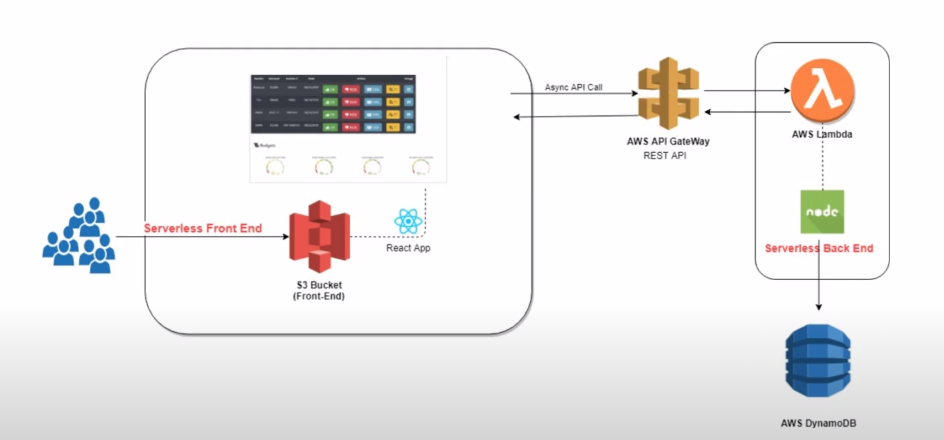
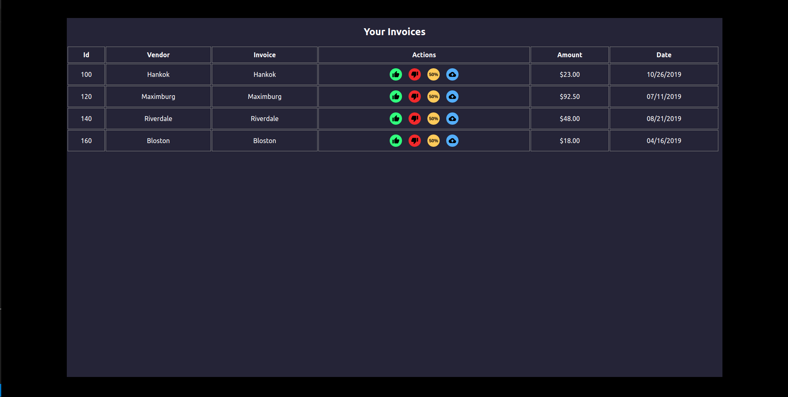

### React Project Using AWS Lambda, S3 Bucket, Dynamo DB, API Gateway

- Project Infrastructure

- Steps
1. Create React Project
2. Build Project
3. Create S3 Bucket
4. Change Website Policy
5. Create site url
6. Now install aws-cli
7. Create IAM user on AWS IAM User console
8. Get Access Key ID and Secret Key
9. Set up credentials in aws-cli with access Key ID and secret Key
10. Now deploy the react project with S3 Bucket
